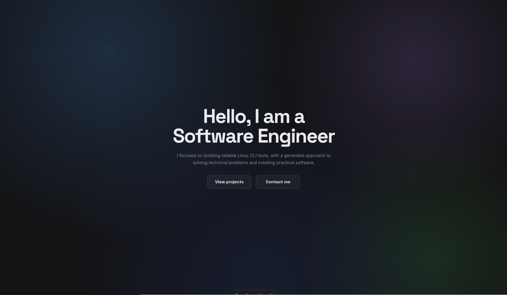

# Devspace

**A single-page portfolio that introduces me, my skills, and my projects.**

This repository holds my personal portfolio: a single web page that tells a visitor everything they need to know about me as a developer. It shows who I am, the technologies I work with, the projects I have built, and how to reach me — all in one place, with a clean design and a few tasteful animations.

The site is live at [ckhgy.com](https://ckhgy.com).

## Built to a professional standard

- **Fast** — the pages are pre-built in advance, so visitors download plain files rather than waiting for anything to be assembled.
- **Works everywhere** — designed to look and behave well on phones, tablets, and desktops.
- **Easy to find** — set up so search engines can read it properly: a sitemap, page descriptions, and structured data.
- **Respectful of preferences** — visitors who turn on "reduce motion" in their system settings get the same page with the animation switched off.
- **Tested** — an automated test suite and strict type checking catch mistakes before they reach the page.
